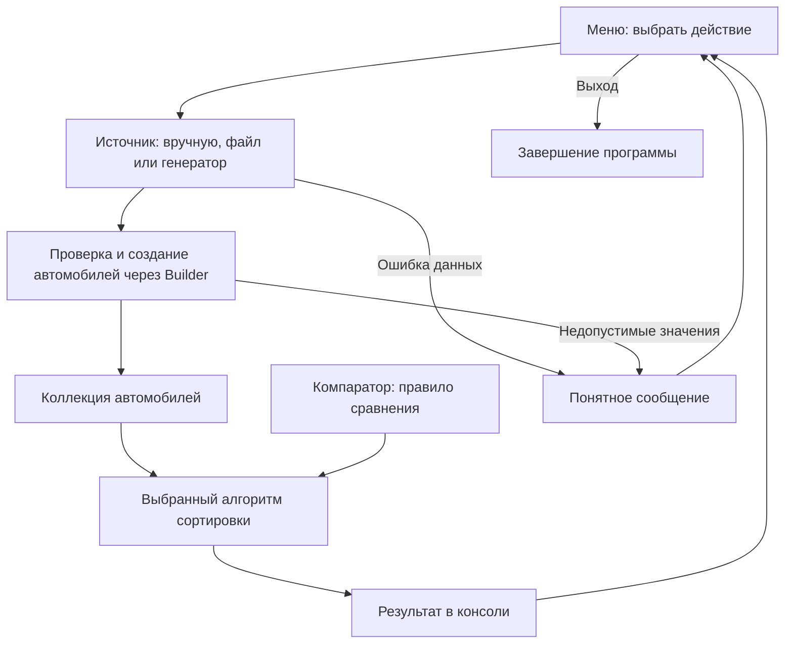

# Как будет устроена программа

Здесь описана архитектура: из каких частей состоит приложение и за что отвечает каждая часть. Сейчас работают модель `Car` с Builder, коллекция `MyArrayList<T>`, общий `ConsoleInput`, меню `ConsoleApplication` и загрузка из файла через `FileCarSource`. Меню позволяет задать путь и количество, просмотреть данные и выйти. `Modules` подключает первый источник. Сортировка пока обозначена заглушкой. Добавлены пять общих интерфейсов; реализация пока есть у `DataSource<Car>`. Их точные [договоры](contracts.md) — основа работы команды; остальные части ниже описаны как план.

Выбор автомобиля, трёх алгоритмов и порядка сравнения — решения проекта. Их нужно отличать от общих [требований задания](requirements.md). Сначала тимлид готовит [работающий каркас](scaffold.md) с одним источником, компаратором и алгоритмом; команда расширяет его, затем переходит к дополнениям.

## Один пример от ввода до результата

Пользователь выбирает файл и количество автомобилей, затем сортировку по мощности. Программа читает записи, проверяет их, создаёт объекты и меняет их порядок.

```text
До сортировки                 После сортировки

Kia,  150, 2020               Audi, 100, 2018
Audi, 100, 2018       →       Ford, 120, 2022
Ford, 120, 2022               Kia,  150, 2020
```

Перемещается целый автомобиль. Его модель, мощность и год остаются вместе.



Схема показывает общий путь. При ручном вводе ошибочное значение можно запросить повторно, не начиная всю работу заново.

## Кто за что отвечает

| Часть | Назначение |
| --- | --- |
| `Main` | Запустить приложение |
| `ConsoleApplication` | Показать меню, вызвать нужную операцию и сохранить текущие данные |
| `Car` | Хранить данные одного автомобиля |
| `Car.Builder` | Создать автомобиль и проверить допустимость его полей |
| `MyArrayList<T>` | Хранить несколько объектов, добавлять их и получать по индексу |
| Источники данных | Получить нужное количество автомобилей |
| Компараторы | Сравнить два автомобиля по выбранному правилу |
| Стратегии сортировки | Упорядочить коллекцию с помощью компаратора |

Например, меню не должно читать строки файла внутри своей команды сортировки. Оно вызывает источник, получает коллекцию, а затем передаёт её выбранному алгоритму. Это помогает разрабатывать и проверять части отдельно.

## Автомобиль и Builder

`Car` имеет три поля: `int power`, `String model`, `int productionYear`. Созданный автомобиль не меняется: методы чтения полей есть, методов изменения нет.

Builder — отдельный объект, в котором сначала указывают поля, а затем создают готовый автомобиль:

```java
Car car = new Car.Builder()
        .power(150)
        .model("Kia")
        .productionYear(2020)
        .build();
```

Правила данных, реализованные в `Car.Builder.build()`:

- Мощность — положительное целое число.
- Модель — непустая строка после удаления пробелов по краям. Разделитель `;` и переводы строк запрещены в любом месте исходной строки из-за простого файлового формата.
- Год — от 1900 до текущего года включительно.
- Все три поля обязательны.

Это конкретные правила нашего проекта. В условии требуется валидация, но точные границы значений не заданы.

Builder уже отклоняет недопустимые значения, например мощность `-10`, с помощью `IllegalArgumentException` — исключения с описанием ошибки в переданных данных. Вызов `build()` возвращает готовый `Car`, только если все поля допустимы.

Файловый парсер отдельно проверяет формат: например, сообщает, что `abc` нельзя преобразовать в число. После преобразования он вызывает Builder. Остальные источники также будут создавать автомобили через этот Builder, чтобы правила модели оставались общими.

## Коллекция и обозначение T

Коллекция — контейнер для нескольких объектов. В качестве общей основы реализован собственный динамический массив `MyArrayList<T>`. Когда места внутри не хватает, он создаёт более вместительный массив и переносит элементы.

`T` обозначает тип элементов:

```java
MyArrayList<Car> cars;        // Коллекция автомобилей
MyArrayList<String> names;    // Коллекция строк
```

Код самой коллекции одинаковый. Она не знает, что такое мощность или год.

Минимальный набор методов:

| Метод | Для чего нужен |
| --- | --- |
| `add(item)` | Добавить объект в конец |
| `get(index)` | Получить объект по индексу |
| `set(index, item)` | Заменить объект на указанном месте |
| `size()` | Узнать количество объектов |
| `isEmpty()` | Проверить, пустая ли коллекция |
| `copy()` | Создать отдельный контейнер с теми же объектами |

Индексы начинаются с нуля. Значение `null` в коллекцию не добавляем. `copy()` копирует контейнер, а не каждый автомобиль; для неизменяемой модели этого достаточно.

Собственная коллекция требуется только в дополнительном задании `3*`; для основной части допустим стандартный `ArrayList`. В проекте уже подготовлен и проверен `MyArrayList`, поэтому оставляем его текущим общим контейнером. Использование коллекции в будущем заполнении через Stream нужно будет проверить отдельно.

## Источники данных и единый интерфейс

Интерфейс — договор о том, какие методы предоставляет класс. Разные реализации могут выполнять этот договор по-разному.

Для источников добавлен интерфейс `DataSource<T>` с методом:

```java
MyArrayList<T> load(int length) throws IOException;
```

Он получает требуемое количество объектов и возвращает новую заполненную коллекцию. Запись `throws IOException` означает, что при проблеме чтения метод может сообщить об ошибке вызывающему коду.

Предусмотрены три обычные реализации:

- `ManualCarSource` — запросить автомобили у пользователя; задача участника 2.
- `FileCarSource` — получить автомобили из файла; реализован и подключён.
- `RandomCarSource` — создать случайные допустимые автомобили; задача участника 3.

При успехе возвращается ровно `length` корректных объектов. Длина должна быть положительной. При ошибке источник сообщает о ней, а не возвращает незаметно укороченную коллекцию.

Вспомогательные части готовятся вместе с соответствующими источниками:

- `ConsoleInput` — готовый общий читатель консоли в пакете `sorting.input`; создан один раз в `Main` и передан меню, позже будет использоваться ручным источником.
- `CarLineParser` — готовое преобразование одной строки файла в автомобиль; используется файловым источником.
- `CarConsoleReader` — чтение одного автомобиля через Builder; задача участника 2 вместе с ручным источником.
- `CarGenerator` — создание одного случайного автомобиля; задача участника 3 вместе со случайным источником.

Эти небольшие части будут использовать и обычные источники, и версии через Stream. Это позволит не дублировать правила ввода.

### Формат файла

UTF-8, без заголовка; на каждой строке мощность, модель и год, разделённые `;`:

```text
150;Kia;2020
100;Audi;2018
120;Ford;2022
```

В строке должно быть ровно три поля. Пробелы по краям полей удаляются. Пустая строка, неправильное число или нарушение правил Builder — ошибка с номером строки и причиной.

Договор для загрузки: проверяем весь файл. Если записей меньше запрошенного числа, сообщаем об ошибке. Если больше — возвращаем первые `length` записей после проверки всех строк. Ошибки в оставшейся части файла не игнорируем.

## Компаратор и алгоритм сортировки

Компаратор сравнивает **два объекта**. Алгоритм многократно вызывает компаратор и решает, как переставлять элементы **всей коллекции**.

Метод `compare(first, second)` возвращает:

- отрицательное число — первый объект должен идти раньше;
- ноль — объекты равны по выбранному правилу;
- положительное число — первый объект должен идти позже.

В каркасе тимлид реализует `CarAllFieldsComparator`: сначала мощность; при равенстве — модель; затем год. Модели сравниваем с учётом регистра через `String.compareTo`.

Команда добавит `CarPowerComparator`, `CarModelComparator` и `CarProductionYearComparator` для отдельных полей. Каждый компаратор будет отдельным классом с интерфейсом `Comparator<Car>`, чтобы участники работали в разных файлах. Имена обозначают планируемые классы; сейчас реализации отсутствуют.

Например, в составном порядке получится:

```text
100;Audi;2018
150;Kia;2017
150;Kia;2020
```

Добавленный интерфейс алгоритма:

```java
public interface SortStrategy<T> {
    void sort(MyArrayList<T> items, Comparator<T> comparator);
}
```

Вызывающий код будет выглядеть так:

```java
SortStrategy<Car> strategy = new InsertionSort<>();
Comparator<Car> comparator = new CarAllFieldsComparator();

strategy.sort(cars, comparator);
```

Здесь `cars` — что сортировать, `comparator` — как сравнивать, `strategy` — каким алгоритмом переставлять.

В каркасе появится `InsertionSort<T>` — сортировка вставками. Команда добавит `SelectionSort<T>` — выбором и `BubbleSort<T>` — пузырьком. Возможность заменить одну реализацию другой через общий интерфейс и будет применением паттерна Strategy. Три алгоритма — решение проекта; точное количество в условии не установлено.

Алгоритм должен работать с переданным компаратором и не обращаться напрямую к `Car.getPower()`. Поэтому при смене поля достаточно другого компаратора. При смене автомобиля на студента алгоритм и коллекция сохранятся, но модель, ввод и сравнение студентов потребуют отдельного кода.

Сортировка меняет порядок элементов в переданной коллекции. Размер, сами объекты и число их повторений сохраняются. Пустая коллекция и один элемент допустимы. Относительный порядок равных по компаратору объектов не фиксируем.

## Как подключаются дополнительные задания

Для дополнительных возможностей добавлены интерфейсы `EvenSorter<T>`, `ResultWriter<T>` и `OccurrenceCounter<T>`. Реализации допов подключаем после готовности основной части. Каркас работает с файловым источником и обычной сортировкой без этих модулей. Если в меню показан ещё недоступный пункт, он сообщает «Функция пока не реализована»; такая заглушка не считается готовой функцией.

| Дополнение | Что получает модуль | Что делает |
| --- | --- | --- |
| Чётный режим | Коллекцию, способ получить целое число из объекта и выбранную стратегию | Переставляет только объекты с чётным значением |
| Запись | Коллекцию и путь к файлу | Добавляет записи в конец файла |
| Stream | Те же входные данные, что обычные источники | Создаёт и собирает объекты через поток операций |
| Подсчёт | Коллекцию, образец и количество рабочих потоков | Возвращает количество совпадений |

### Чётный режим

Планируемый класс — `EvenValueSort<T>`, реализация `EvenSorter<T>`. Он выбирает объекты с чётной мощностью, сортирует их переданной стратегией по мощности и возвращает на соответствующие позиции. Объекты с нечётной мощностью остаются на прежних индексах.

```text
До:    A:7   B:8   C:3   D:2
После: A:7   D:2   C:3   B:8
```

Буква обозначает автомобиль, число — его мощность. Чётность относится к значению поля, а не к индексу.

Чтобы не привязывать универсальный модуль к `Car`, передадим ему `ToIntFunction<T>` — функцию, получающую из объекта целое число. Для автомобиля это будет `Car::getPower`, то есть вызов метода получения мощности.

### Добавление в файл

`CarFileWriter` будет реализовывать `ResultWriter<Car>` и записывать строки в том же формате, что читает файловый источник. Используется UTF-8 и режим добавления; существующий текст не стирается. Если файла нет, он создаётся. Ошибка записи передаётся меню, а не выдаётся за успех.

### Заполнение через Stream

Stream — последовательность операций над элементами: получить значение, преобразовать его и передать дальше. Это не обязательно выполнение в нескольких потоках.

Участник добавляет отдельные источники, реализующие тот же `DataSource<Car>`:

```text
Обычные источники                  Источники через Stream
ManualCarSource                   StreamManualCarSource
FileCarSource                     StreamFileCarSource
RandomCarSource                   StreamRandomCarSource
```

Версии через Stream используют общие `CarConsoleReader`, `CarLineParser` и `CarGenerator`. Объекты должны создаваться или разбираться в процессе работы Stream; просто обернуть уже заполненную коллекцию недостаточно.

Заполнение выполняется последовательно: наша коллекция не рассчитана на одновременное добавление из разных потоков. `Stream.sorted()` не используем — сортировку нужно написать самостоятельно.

До готовности новых источников основное приложение использует обычные. После проверок тимлид переключает реализации в `Modules` — обычном классе, где выбираются подключаемые компоненты.

### Многопоточный подсчёт

`ParallelOccurrenceCounter<T>` будет реализовывать `OccurrenceCounter<T>`: получать коллекцию, искомый элемент и максимальное число рабочих потоков. Коллекция делится на непересекающиеся диапазоны; каждый поток считает свою часть, затем результаты складываются. Во время подсчёта коллекция не изменяется.

Для проекта считаем совпадением равенство всех трёх полей автомобиля через `equals`; это правило для `Car` тимлид подготовит перед подключением подсчёта. Оно не требуется для первого сценария сортировки. Под обозначением `N` понимаем автомобиль-образец; это выбранная трактовка условия. Метод возвращает число, а меню выводит его в консоль. Подсчёт не требует предварительной сортировки.

## Меню и сохранение данных

Меню уже хранит исходную коллекцию: новая успешная загрузка заменяет прежнюю, ошибочная сохраняет её. Для сортировки будет добавлен отдельный последний успешный результат. Сортировка будет работать с копией контейнера. Это позволит повторно выбирать разные порядки для одних исходных данных.

Неудачная загрузка сохраняет предыдущие данные и результат. Неудачная сортировка не должна уничтожать последний успешный результат. Ошибки пользовательского ввода возвращают к работе с приложением; обычный выход выполняется только соответствующим пунктом меню.

## Планируемые папки

Пакет Java группирует связанные классы. Его имя соответствует пути внутри `src/`.

```text
src/sorting/
  app/          запуск, меню и подключение модулей
  input/        общий читатель консоли
  model/        автомобиль и его Builder
  collection/   собственная коллекция
  contract/     общие интерфейсы
  compare/      правила сравнения автомобилей
  source/       обычные источники и общие средства ввода
    stream/     источники через Stream
  algorithm/    обычные сортировки и чётный режим
  output/       добавление результатов в файл
  count/        многопоточный подсчёт

test/           проверки, написанные командой
examples/       примеры входных данных и фактических запусков
docs/           документация
```

Эти папки будут появляться вместе с соответствующим кодом. Порядок реализации и обязанности участников находятся в [плане разработки](development-plan.md).
